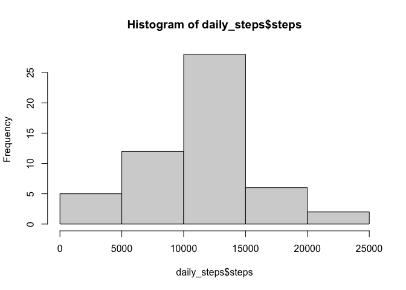
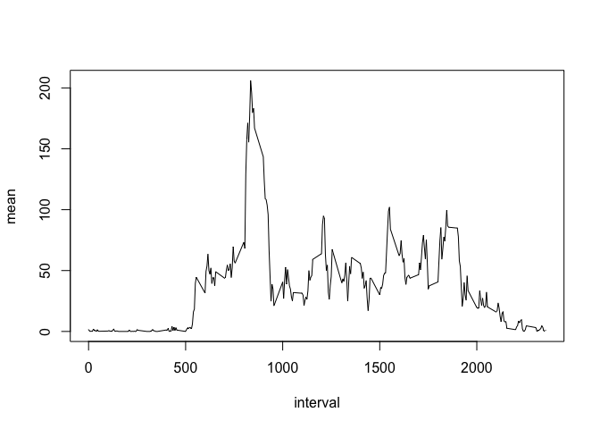
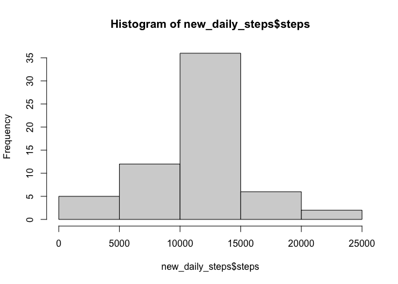
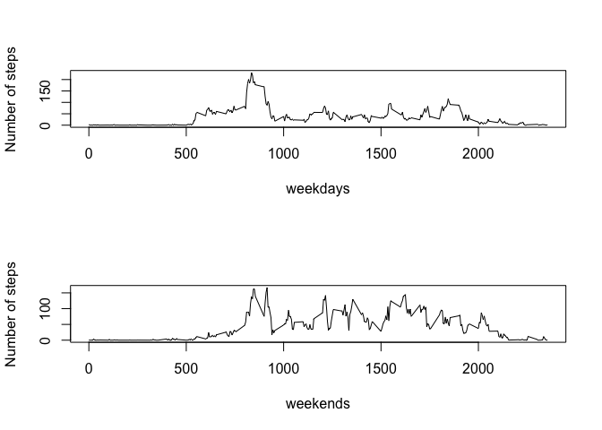

## Loading and preprocessing the data

```r
library(readr)
repdata <- read_csv("activity.zip",col_types=cols(steps = col_double(), date = col_date(format = ""), interval = col_double()))
```


## What is mean total number of steps taken per day?

```r
library(dplyr)
daily_steps <- group_by(repdata, date) %>% summarize(steps = sum(steps, na.rm = F))
mean_daily_steps <- mean(daily_steps$steps, na.rm = T)
median_daily_steps <- median(daily_steps$steps, na.rm = T)
hist(daily_steps$steps)
```

<!-- -->
  
The mean number of daily steps is: 10766.19  
The median number of daily steps is: 10765  


## What is the average daily activity pattern?

```r
avg_intvl_steps <- group_by(repdata, interval) %>% summarize(mean = mean(steps, na.rm = T))
plot(avg_intvl_steps, type="l")
```

<!-- -->

```r
max_intvl <- which.max(avg_intvl_steps$mean) * 5
max_intvl_time <- as.integer(max_intvl / 60) * 100 + (max_intvl %% 60)
```
  
The interval containing the maximum number of steps is time interval 840  


## Imputing missing values
Number of missing values: 2304


```r
for (i in 1:length(repdata$steps)) {
    if (is.na(repdata$steps[i])) {
        for (j in 1:nrow(avg_intvl_steps)) {
            if (avg_intvl_steps$interval[j] == repdata$interval[i]) {
                repdata$steps[i] <- avg_intvl_steps$mean[j]
                break
            }
        }
    }
}
new_daily_steps <- group_by(repdata, date) %>% summarize(steps = sum(steps, na.rm = F))
hist(new_daily_steps$steps)  
```

<!-- -->
  
New Mean: 10766.19  
New Median: 10766.19


## Are there differences in activity patterns between weekdays and weekends?

```r
repdata_daytype <- mutate(repdata, daytype = as.factor(ifelse(weekdays(date) == "Saturday" | weekdays(date) == "Sunday", "weekend", "weekday")))
avg_intvl_steps_weekdays <- filter(repdata_daytype, daytype == "weekday") %>% group_by(interval) %>% summarize(mean = mean(steps, na.rm = T))
avg_intvl_steps_weekends <- filter(repdata_daytype, daytype == "weekend") %>% group_by(interval) %>% summarize(mean = mean(steps, na.rm = T))

par(mfrow=c(2,1))
plot(filter(avg_intvl_steps_weekdays), type="l", xlab="weekdays", ylab="Number of steps")
plot(filter(avg_intvl_steps_weekends), type="l", xlab="weekends", ylab="Number of steps")
```

<!-- -->
